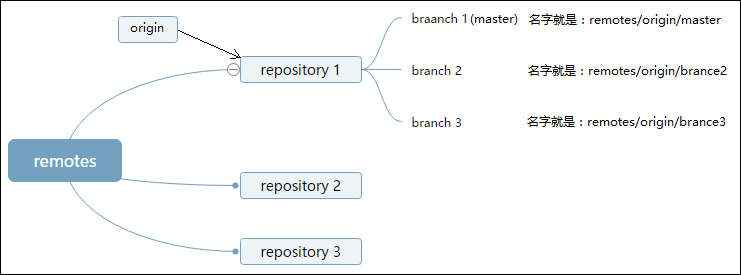

# GIT
[Learn Enough Git to Be Dangerous](https://www.learnenough.com/git-tutorial?single_page=1#cha-1_footnote-4)
### locate git cmd
```
where git //windows
which git //unix
```
### after install before use
```
git config --global user.name "HongliangWang"
git config --global user.email "whl7770@gmail.com"
git config --global --list //list the global config
```
this configuration allow GIT to identify your changes by name and email address,which is especially helpful when collaborating with others!
### alias
```
git config --gloable alias.co checkout //co means checkout
```
### initializing the repository
```
[C:\myproject] $ git init
```
### make new file
```
touch index.html //unix
type null>index.html  //win ">>":append a new line
echo null>index.html  //win
```
### query status&add track file
```
git status
git add -A //add all --all
```
### commit modify
```
git commit -m //--message -a --all
```

### query latest commit message
```
git log
git log -p
```
### amend the last commit
```
git commit --amend
```
### [Connecting to GitHub with SSH](https://help.github.com/en/articles/connecting-to-github-with-ssh)

### create a new repository on the command line
```
echo "# project_name" >> README.md
git init
git add README.md
git commit -m "first commit"
git remote add origin git@github.com:wszwr003/project_name.git   //git remote rm origin
git push -u origin master
```
### 关于origin和master
git的服务器端(remote)端包含多个repository，每个repository可以理解为一个项目。而每个repository下有多个branch。"origin"就是指向某一个repository的指针。服务器端的"master"（强调服务器端是因为本地端也有master）就是指向某个repository的一个branch的指针。

```
git push A B:C     
```
其中A和C是分别remote端的一个repository的名字和branch的名字，B是本地端branch的名字
意思是把本地的B推送到remotes/A/C下。当B=C时可以直接省略为：git push A B。比如：
```
git push origin master:master //equals
git push origin master
```

### modify eg.
```
[project_dir (master)]$ git diff
[project_dir (master)]$ git status
[project_dir (master)]$ git add -A
[project_dir (master)]$ git commit -m "modify something"
[project_dir (master)]$ git push
```
### branch and merge
```
[project_dir (master)]$ git checkout -b about-page  //checkout & make an new branch
[project_dir (about-page)]$

[project_dir (about-page)]$ git branch //query the current branches
* about-page
master

[project_dir (about-page)]$ git checkout master //from about-page into master
[project_dir (master)]$
[project_dir (master)]$ git merge about-page //merge about-page into master

git branch -d about-page  //if merged
git branch -D about-page  //even not merged
```
### create tag
```
$ git tag -a v1.4-annotated -m 'my version 1.4'
$ git tag v1.4-lightweight 
$ git tag
$ git show v1.4
```

